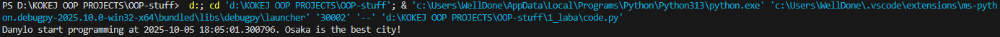
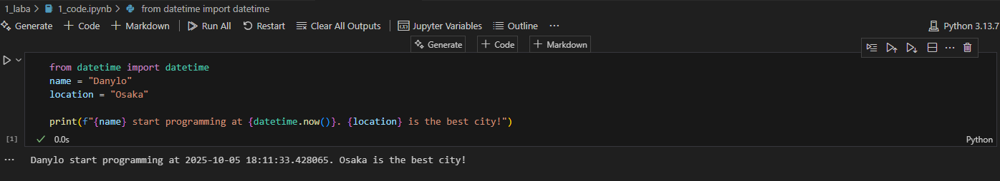

# Звіт до роботи
## Тема: _Вступні заняття: налаштування середовища, прочаток роботи з Python та Markdown_
### Мета роботи: _Налаштувати середовище роботи VS Code, створити репозиторій Github та налаштувати інтеграцію з ним, написати першу програму на Python та створити звіт з використанням форматування Markdown_

---
### Виконання роботи
* Результати виконання завдання;
    1. Створили в репозиторії папку для роботи: ([1_laba](/1_laba/ ))
    1. Створили файл з розширенням ``.py`` та скопіювали туди код програми: ([code.py](./code.py))
    ```python
   from datetime import datetime
   name = "Bohdan"
   location = "Lviv"

   print(f"{name} start programming at {datetime.now()}. {location} is the best city!")
    ```
    3. Змінили значення ``name`` i ``location`` на свої
    1. 
    1. Створили файл з розширенням ``.ipynb`` ([1_code.ipynb](./1_code.ipynb))
    1. Скопіювали код та натиснули кнопку ``Run all``
    1. 
    1. Створили комірку з ``Markdown``
    1. Натиснули ``Run all``, потім змінили комірку за допомогою ``Edit cell``
    1. )

---
### Висновок:
> у висновку потрібно відповісти на запитання:

- :question: Що зроблено в роботі;
- :question: Чи досягнуто мети роботи: ``Так``;
- :question: Які нові знання отримано ``Отримано знання роботи з форматом (.ipynb), та більше розуміння використання формату (.md)``;
- :question: Чи вдалось відповісти на всі питання задані в ході роботи:``Так``;
- :question: Чи вдалося виконати всі завдання:``Так``;
- :question: Чи виникли складності у виконанні завдання:``Ні``;
- :question: Чи подобається такий формат здачі роботи (Feedback): ``Так``;
- :question: Побажання для покращення (Suggestions):``none``;

---